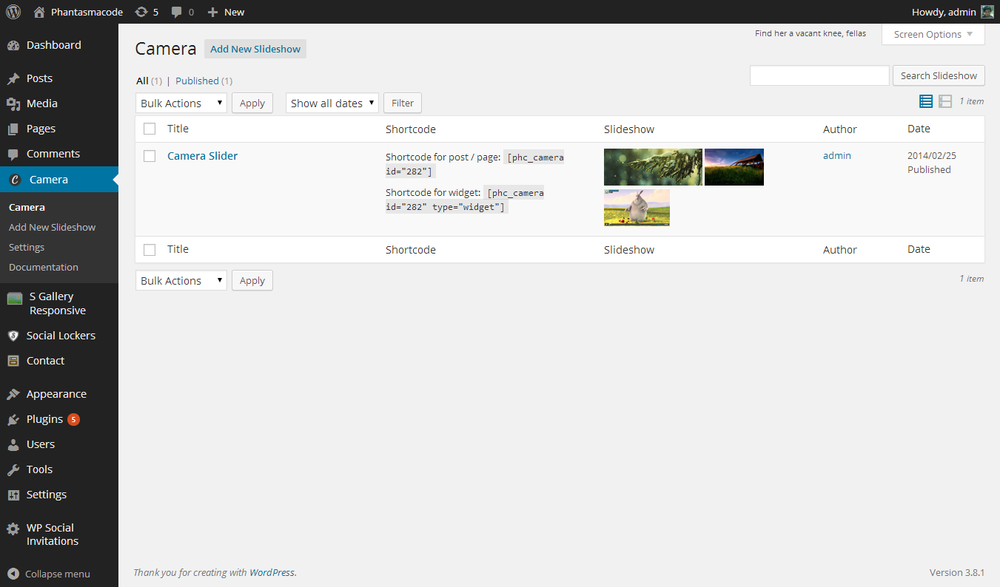
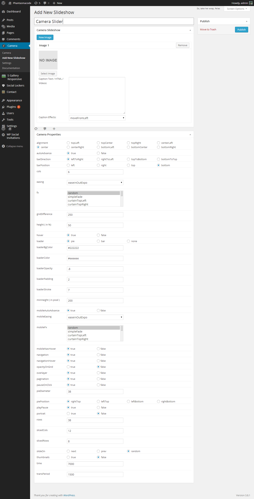
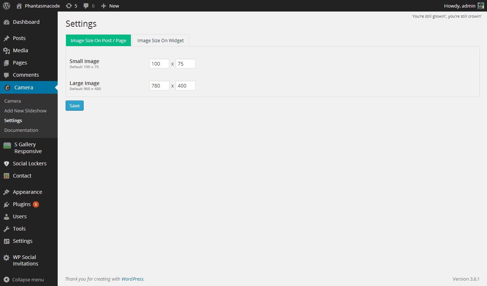
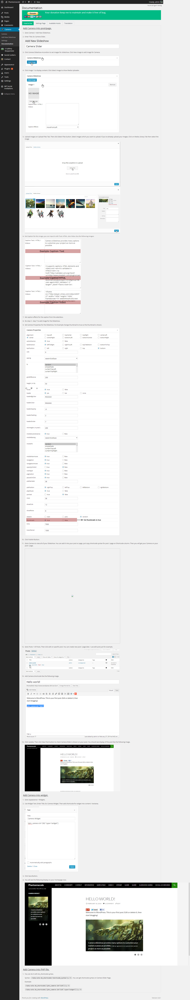
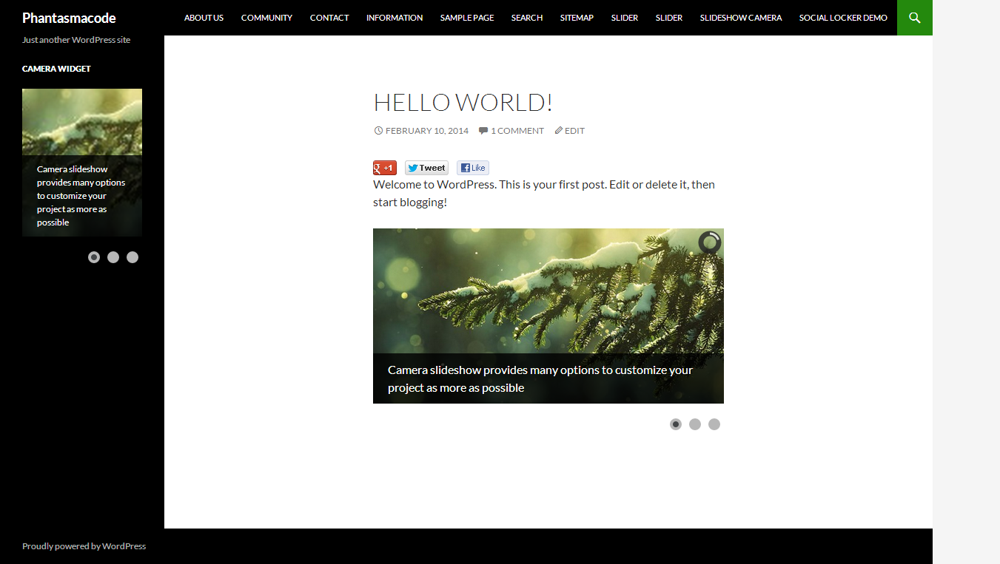

# Wordpress Plugin - Camera Slideshow

Camera Slideshow is jQuery slideshow with many effects, transitions, easy to customize, using canvas and mobile ready, based on jQuery 1.4+. You can add it into post / page / widget Wordpress.

How to Install it to your Wordpress Site:
* Extract zip Package.
* Rename it to phc-camera.
* Copy it into wp-content\plugins.
* Goto Plugins.
* Click Activate on Camera.

Features:
* Of Course it's easy to use.
* Good User Interface.
* WordPress 3.5 Media Uploader.
* Auto Regenerate Images.
* Translation available ( welcome for contributor ).
* Setting Page to set image size.
* Available Custom Hooks.
* Complete Documentation Page.

License: 
* [GNU GPL](http://www.gnu.org/licenses/gpl-3.0.txt)

Credits:
* Manuel Masia to create [JQuery Plugin Camera Slideshow](http://www.pixedelic.com/plugins/camera/)

## Screenshot

